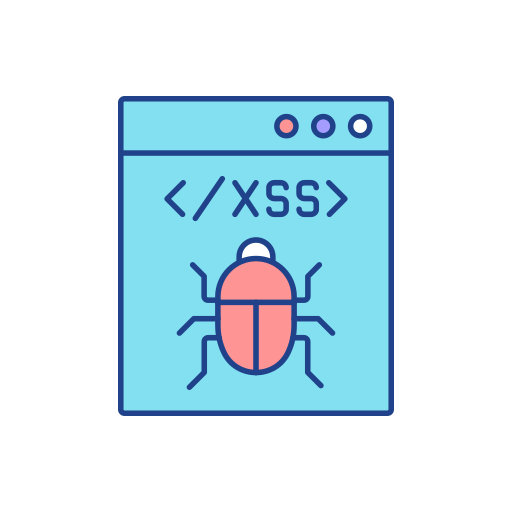
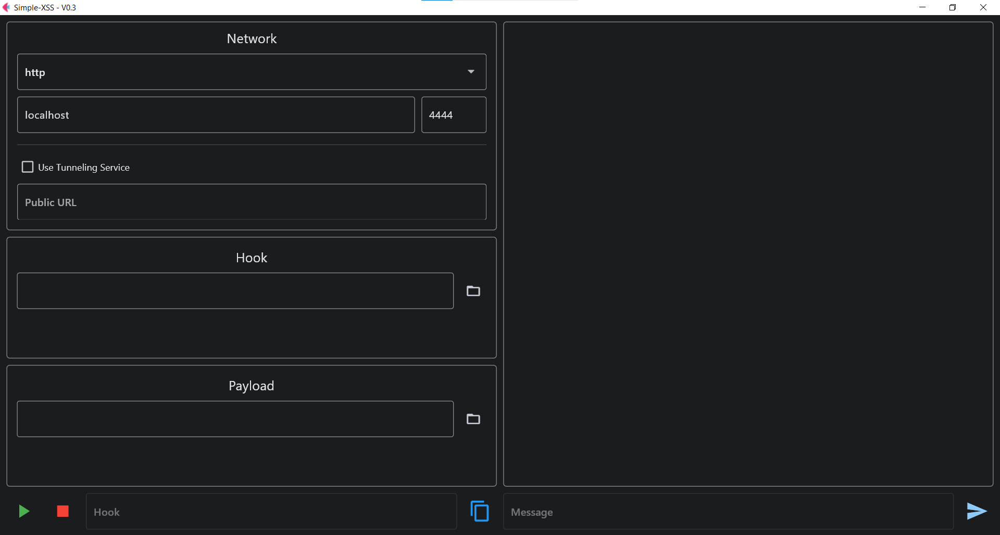

# Simple-XSS

<p align="center">
  
</p>

<p align="center">
    <a href="https://github.com/CrazyProger1/Simple-XSS/releases/download/V0.2/Simple-XSS-Windows-x64.zip"></a>
    <a href="https://github.com/CrazyProger1/Simple-XSS/blob/master/LICENSE"></a>
    <a href="https://github.com/CrazyProger1/Simple-XSS/releases/latest"></a>
</p>

Simple-XSS is a multi-platform cross-site scripting (XSS) vulnerability exploitation tool for pentesting.

Problems solved by Simple-XSS:

- [x] Easy creatable payloads & hooks
- [x] Support of several transport services (HTTP, Websocket)
- [x] Support of several tunneling services (to deliver payload even without white IP)

**Disclaimer:** This program is provided for educational and research purposes only.
The creator of this program does not condone or support any illegal or malicious activity,
and will not be held responsible for any such actions taken by others who may use this program.
By downloading or using this program, you acknowledge that you are solely responsible for any consequences
that may result from the use of this program.

## Vocabulary

**Hook** - snippet of JS code designed to be injected via XSS on the client side.

**Payload** - a program that will be launched remotely in the client’s browser.

## Usage

## Status

**V0.3 - indev(refactoring)**

### GUI-Guide

## Interface

> _Thanks to the use of the [Python Flet framework](https://flet.dev/), the application works equally well both in the
browser and in the graphical interface._

### Graphical



## Warning

In favor of ease of use and expanded capabilities, we had to sacrifice backward compatibility between versions 0.2 and
0.3. The features of the previous version are retained and expanded, but older versions of hook & payload will not work.

## Installation

**Note:** _make sure you have installed [Python 3.11](https://www.python.org/downloads/release/python-3115/)_

First you need to clone the repository:

```commandline
git clone https://github.com/CrazyProger1/Simple-XSS
```

Then go to the folder & install the requirements:

**For Window:**

```commandline
cd Simple-XSS
pip install -r requirements/windows.txt
```

**For Linux:**

```commandline
cd Simple-XSS
pip install -r  requirements/linux.txt
```

And finally you can launch it:

```commandline
python main.py
```

## License

Simple-XSS is released under the MIT License. See the bundled [LICENSE](LICENSE) file for details.
