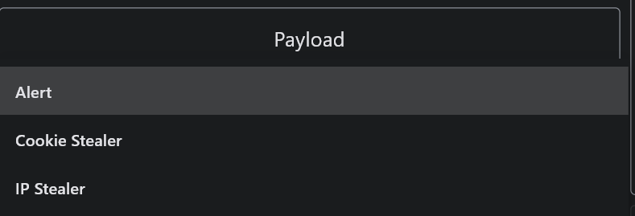
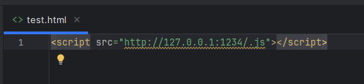

# Simple-XSS Guide

- Choose transport option:

- Enter a convenient host and port on which the transport server should run:

- Choose tunneling option (if you have a white IP or want to test locally - turn off "Use Tunneling Service"):

- Choose hook option:

- Choose payload option:

- Run the process:

- You'll see hook, copy it:

- Test your hook:

- Client hooked, now you can enter and send text:

- See alert:

