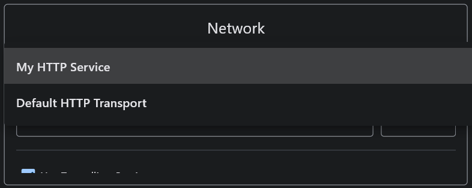
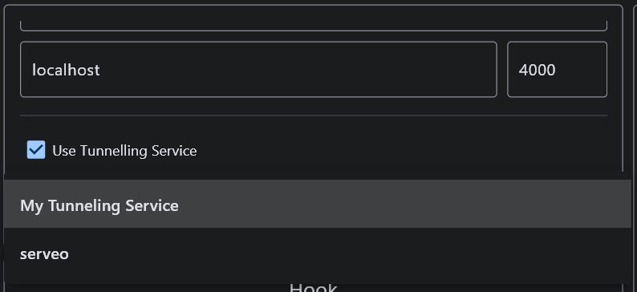

# Simple-XSS Plugins

Simple-XSS is designed to be expendable, almost any component can be replaced at runtime.

## DI-System

Dependency injection tools allows to replace almost any component in program at runtime. It uses container-based
system, where container stores all dependencies.

Any dependency can be injected into a function/method using the ```@inject``` decorator:

```python
from simplexss.utils.di import inject


@inject
def on_settings_loaded(self, settings=CoreContainer.settings):
    print(f'Settings loaded: {settings}')
```

**Core Container:**

```python
class CoreContainer(containers.Container):
    arguments_schema = dependencies.Dependency(ArgumentsSchema)
    settings_schema = dependencies.Dependency(SettingsSchema)

    arguments_parser = dependencies.Factory(SchemedArgumentParser, kwargs={'schema': arguments_schema})
    settings_loader = dependencies.Factory(TOMLLoader)

    arguments = dependencies.Dependency()
    settings = dependencies.Dependency()

    plugin_class = dependencies.Dependency(BasePlugin)
    plugin_manager = dependencies.Singleton(PackageManager)

    hook_class = dependencies.Dependency(BaseHook)
    hook_manager = dependencies.Singleton(PackageManager)

    payload_class = dependencies.Dependency(BasePayload)
    payload_manager = dependencies.Singleton(PackageManager)

    ui_factory = dependencies.Factory(UIFactory)

    tunneling_service_factory = dependencies.Factory(TunnelingServiceFactory)
    transport_service_factory = dependencies.Factory(TransportServiceFactory)

    io_manager = dependencies.Singleton(IOManagerAPI)

    ui_context = dependencies.Singleton(
        UIContext,
        kwargs={
            'settings': settings,
            'arguments': arguments
        }
    )

    processor = dependencies.Factory(
        SimpleXSSProcessor,
        kwargs={
            'arguments': arguments,
            'settings': settings,
            'transport_factory': transport_service_factory,
            'tunneling_factory': tunneling_service_factory,
            'hook_manager': hook_manager,
            'payload_manager': payload_manager,
            'io_manager': io_manager,
            'ui_context': ui_context
        }
    )

    core = dependencies.Singleton(
        Core,
        kwargs={
            'arguments': arguments,
            'settings': settings,
            'ui_factory': ui_factory,
            'processor': processor
        }
    )
```

**GUI Container:**

```python
class GUIContainer(containers.Container):
    main_page = dependencies.Dependency()

    error_banner = dependencies.Factory(ErrorBanner)
    warning_banner = dependencies.Factory(WarningBanner)

    network_box = dependencies.Factory(NetworkBox, kwargs={
        'tunneling_factory': CoreContainer.tunneling_service_factory,
        'transport_factory': CoreContainer.transport_service_factory,
    })
    hook_box = dependencies.Factory(HookBox, kwargs={
        'manager': CoreContainer.hook_manager,
        'transport_factory': CoreContainer.transport_service_factory,
    })
    payload_box = dependencies.Factory(PayloadBox, kwargs={
        'manager': CoreContainer.payload_manager,
    })
    process_control_box = dependencies.Factory(ProcessControlBox)
    message_area_box = dependencies.Factory(MessageAreaBox, kwargs={
        'io_manager': CoreContainer.io_manager,
    })
    message_control_box = dependencies.Factory(MessageControlBox, kwargs={
        'io_manager': CoreContainer.io_manager,
    })

    main_box = dependencies.Factory(MainBox, kwargs={
        'network_box': network_box,
        'hook_box': hook_box,
        'payload_box': payload_box,
        'process_control_box': process_control_box,
        'message_area_box': message_area_box,
        'message_control_box': message_control_box
    })

    gui_manager = dependencies.Factory(
        ComponentManager,
        kwargs={
            'component': main_box,
            'page': main_page,
            'context': CoreContainer.ui_context,
            'error_banner': error_banner,
            'warning_banner': warning_banner,
        }
    )
```

## Event-System

## Services

To add transport or tunneling service you can just implement service interface or inherit one of existing services.

### Transport

```python
from simplexss.api import BasePlugin

from simplexss.core.transports import BaseTransportService, BaseSession


class MyService(BaseTransportService):
    NAME = 'My HTTP Service'
    PROTOCOL = 'http'

    async def run(self, host: str, port: int, **kwargs) -> BaseSession:
        pass

    async def stop(self, session: BaseSession) -> None:
        pass


class Plugin(BasePlugin):
    pass
```



### Tunneling

```python
from simplexss.api import BasePlugin

from simplexss.core.tunneling import BaseTunnelingService, BaseSession


class MyService(BaseTunnelingService):
    NAME = 'My Tunneling Service'
    PROTOCOLS = {
        'http',
    }

    async def run(self, protocol: str, port: int) -> BaseSession:
        pass

    async def stop(self, session: BaseSession):
        pass


class Plugin(BasePlugin):
    pass
```

